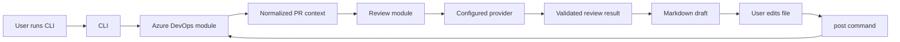

# ADO Assist Design

## Purpose

ADO Assist is a TypeScript CLI-first pull request review assistant for Azure DevOps. It helps teams whose PRs often receive shallow or delayed reviews by drafting structured, editable review feedback before anything is posted to a PR.

The first version is intentionally human-approved. It fetches PR context from Azure DevOps, asks a configurable AI reviewer to assess the change, and writes a Markdown review draft. The user edits that file, then runs a separate command to post only approved comments back to Azure DevOps.

## Goals

- Review Azure DevOps pull requests from a PR URL or explicit CLI arguments.
- Focus on bugs, regressions, maintainability, missing tests, team standards, security, secrets, infrastructure risk, data loss, and production safety.
- Keep style comments lower priority than correctness, test coverage, and risk findings.
- Support OpenAI and Azure OpenAI through a provider adapter selected by configuration.
- Produce an editable Markdown review file before posting comments.
- Preserve a path to webhook or service automation without rewriting the review engine.

## Non-Goals

- Automatically approving, rejecting, or voting on PRs in v1.
- Enforcing Azure DevOps branch policies in v1.
- Providing a web UI in v1.
- Replacing human review ownership. The tool drafts feedback; the user approves it.
- Deep repository-wide semantic analysis beyond the PR diff and available PR metadata in v1.

## User Workflow

The primary workflow has two commands:

```bash
ado-assist review <pr-url>
ado-assist post <review-file>
```

`ado-assist review <pr-url>`:

1. Parses the Azure DevOps PR URL.
2. Fetches PR metadata, changed files, and file diffs.
3. Normalizes the diff into a model-friendly review context.
4. Applies the configured review rubric.
5. Calls the selected AI provider.
6. Validates the structured review result.
7. Writes an editable Markdown review draft.

`ado-assist post <review-file>`:

1. Reads the edited Markdown review file.
2. Extracts only comments that remain in the approved machine-readable section.
3. Posts those comments to the matching Azure DevOps PR.
4. Prints a concise posting summary.

## Review Draft Format

Each review draft contains a human-readable section and a machine-readable section.

The human-readable section includes:

- PR title, author, source branch, target branch, and link.
- High-level change summary.
- Risk summary.
- Suggested inline comments grouped by file and line.
- General PR comments.
- Test coverage concerns.
- Security, secret, infrastructure, data loss, and production-safety concerns.

The machine-readable section stores approved comments in a fenced JSON block. Users can remove entries before posting. The `post` command ignores prose outside that block.

## Architecture

The app is organized as a modular CLI-first TypeScript project.

### CLI Module

Owns command parsing, terminal output, command exit codes, and user-facing errors.

Commands:

- `review <pr-url>`: fetches PR context and writes a review draft.
- `post <review-file>`: posts approved comments from a draft.

The CLI delegates all durable behavior to smaller modules so the same behavior can later be called from a service or webhook handler.

### Azure DevOps Module

Owns Azure DevOps API integration.

Responsibilities:

- Parse PR URLs into organization, project, repository, and PR id.
- Fetch PR metadata.
- Fetch changed files and diffs.
- Post inline and general PR comments.
- Convert Azure DevOps API errors into actionable application errors.

### Review Module

Owns review orchestration.

Responsibilities:

- Build the review context from PR metadata and normalized diffs.
- Apply the default review rubric.
- Add configurable emphasis for general code review, team standards, and risk review.
- Call the provider adapter.
- Validate and normalize model output before it reaches the draft writer.

The default rubric orders feedback by likely value:

1. Correctness bugs and regressions.
2. Security, secrets, infrastructure risk, data loss, and production safety.
3. Missing or weak tests.
4. Maintainability, readability, and architecture concerns.
5. Team standards and style issues.

### Provider Module

Owns model-provider abstraction.

The provider interface exposes one operation:

```ts
reviewPullRequest(input: ReviewInput): Promise<ReviewResult>
```

Implementations:

- OpenAI provider.
- Azure OpenAI provider.

The selected provider is controlled by configuration. The rest of the application does not depend on provider-specific SDK details.

### Draft Module

Owns Markdown review file writing and parsing.

Responsibilities:

- Generate deterministic review filenames.
- Write readable Markdown summaries.
- Include machine-readable comment JSON for posting.
- Parse edited review files.
- Reject invalid or mismatched review files before posting.

### Config Module

Owns configuration loading and validation.

Initial configuration comes from environment variables:

- `ADO_ASSIST_AZURE_DEVOPS_PAT`
- `ADO_ASSIST_AZURE_DEVOPS_ORG`
- `ADO_ASSIST_PROVIDER`
- `ADO_ASSIST_OPENAI_API_KEY`
- `ADO_ASSIST_OPENAI_MODEL`
- `ADO_ASSIST_AZURE_OPENAI_API_KEY`
- `ADO_ASSIST_AZURE_OPENAI_ENDPOINT`
- `ADO_ASSIST_AZURE_OPENAI_DEPLOYMENT`
- `ADO_ASSIST_REVIEW_EMPHASIS`

Configuration validation happens at command startup so missing credentials fail early.

## Data Flow



## Error Handling

The CLI reports concise, actionable failures:

- Invalid PR URL.
- Missing or invalid Azure DevOps PAT.
- Missing provider configuration.
- Azure DevOps API authentication or permission failure.
- PR diff too large for the configured provider.
- Provider rate limit or request failure.
- Invalid model response.
- Review file does not match the PR it is being posted to.

Large diffs are handled conservatively. V1 should fail with a clear message rather than silently reviewing only part of the PR. Later versions can add chunking and multi-pass review.

## Testing Strategy

Unit tests cover:

- Azure DevOps PR URL parsing.
- Configuration validation.
- Review result schema validation.
- Markdown draft writing and parsing.
- Posting parser behavior when comments are removed.

Integration seams use mock Azure DevOps and mock provider clients. V1 does not need live Azure DevOps tests by default because those require credentials and a real project.

Manual verification covers:

- Reviewing a sample PR fixture.
- Editing the generated Markdown file.
- Confirming `post` would post only approved comments when using mocked clients.

## Future Automation Path

The CLI-first architecture leaves room for a later service mode:

- A webhook handler can call the same Azure DevOps, review, provider, and draft modules.
- A background worker can store review drafts or post comments after approval.
- A future policy-gate command can set PR status or vote once the team trusts the results.

V1 avoids direct policy enforcement so the team can tune review quality before the tool affects merge flow.
